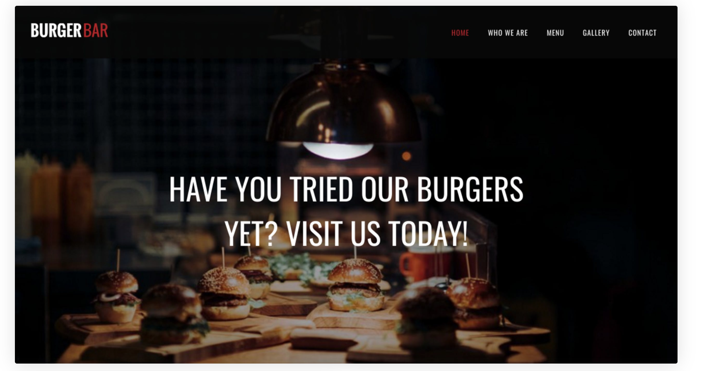
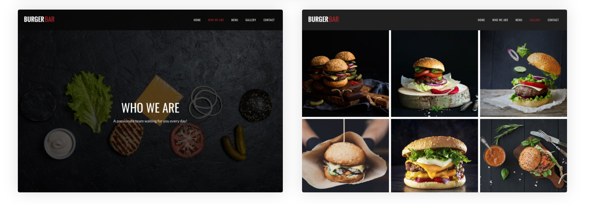
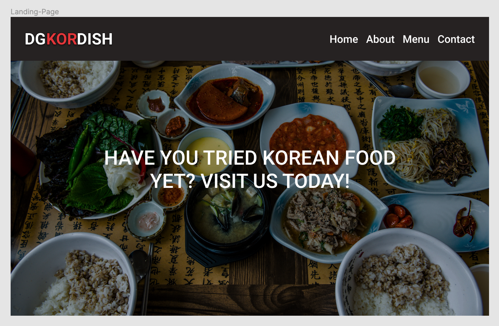
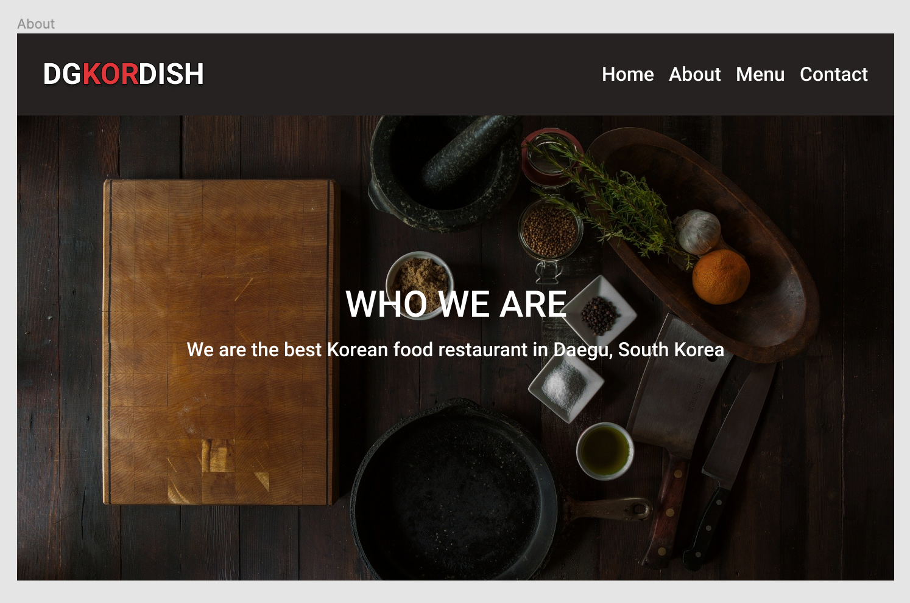
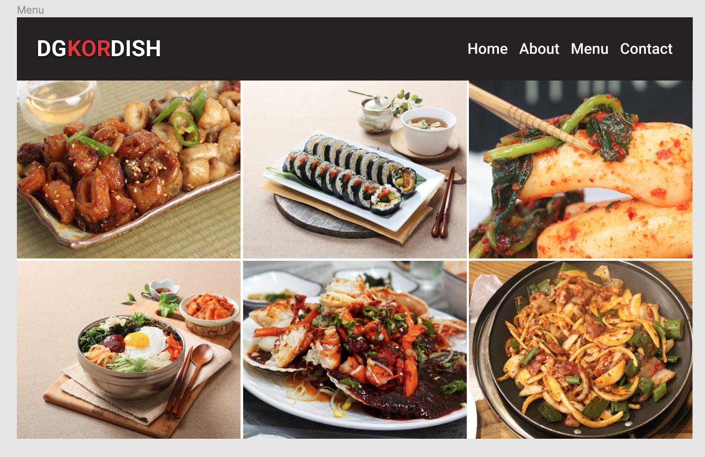
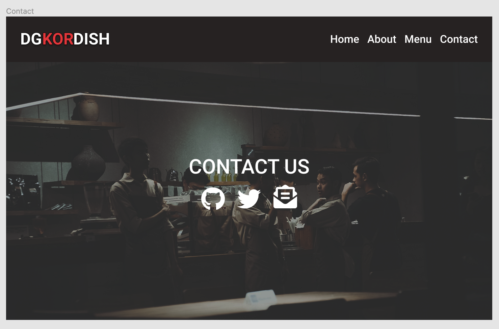
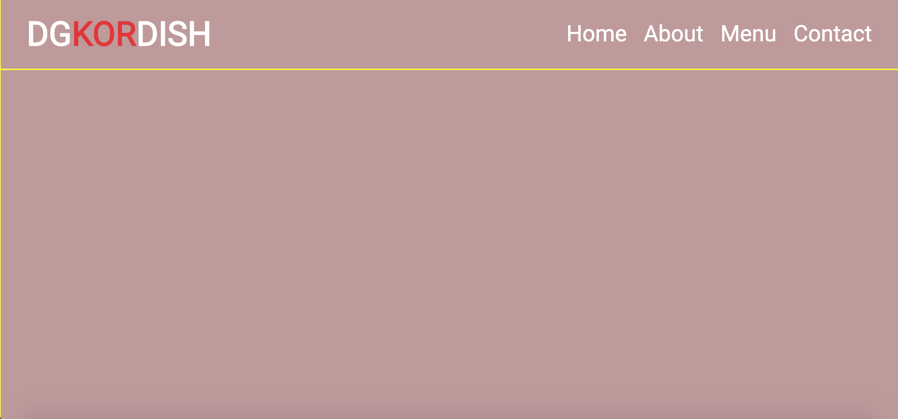

## TOP - Restaurant

## 0819

I'm going through the project instruction of The Odin Project. I am not too sure what this all webpack thing is working, but I will complete first and try to understand little details using [Feynman Technique](https://www.youtube.com/watch?v=FrNqSLPaZLc)

> Create a bare-bons homepage for a restaurant. Include an image, headline, and save copy about how wonderful the restaurant is. It's okay to hard-code these into the HTML for now just to see how they look on the page.

Okay, now I'm at the task4 written above. Let's list the things that I need to do.

1. Decide how your layout will look like(Find a simple restaurant website you want to copy)

2. What type of food your website is about?

3. Prototyping using Figma

  - What device?

### Decide how your layout will look like(Find a simple restaurant website you want to copy)

I've looked at some examples for simple restaurnat websites from [sitebuilderreport](https://www.sitebuilderreport.com/inspiration/restaurant-websites?a=ga&gclid=CjwKCAjwm_P5BRAhEiwAwRzSO8z_wiSp2CKY2-GcbwUferZ04n2apNvlLB1e45rG1X-2hAR8G5_l-RoCAZ0QAvD_BwE), and I decided to do this one.

Landing Page

Other Main Pages

### What type of food your website is about?

My website will be about Korean food since I'm a Korean. I guess I will need to find some quality photos for Korean food.

### Prototype using Figma

#### Home

#### About

#### Menu

#### Contact

So this is how my website will look like! Now it is time for actual coding!

### 08/19 REVIEW

I have finished up until making prototype of my hard code html and css. Tomorrow I will hard code them with html and css.

## 08/20

**HARD CODE HTML AND CSS**

Today, I'm going to hard code the prototype that I made starting from Landing page to About, Menu, and Contact lastly. I am not too sure if I can make it today, but that doesn't matter. I'll just focus on doing it and learn as much as I can!

### TODAY REVIEW

So today, I have made a basic layout and started working on the header. Here's the finished product??? of today.

I have been little stuck at making flex items(`#nav-bar li`) to fit in the flex container(`#nav-bar`). And I have found a weird behaviour. When you give flex items the percentage as their padding value, it will overflow the flex container. However, when you give the pixel as their padding value, it doesn't overflow and the flex container stretches to be the total width of flex items.

I don't know what the differences between them are, I hope someone answer my [post](https://stackoverflow.com/questions/63501553/why-doesnt-flex-container-to-be-the-width-of-flex-items-when-flex-items-paddin?noredirect=1#comment112289357_63501553) that I posted in the stackoverflow.

### UPDATE

Someone answer me with this [link](https://stackoverflow.com/questions/53536266/why-does-percentage-padding-break-my-flex-item). Have a look at it tomorrow.

## 08/21

Today, I started with the [question](https://stackoverflow.com/questions/63501553/why-doesnt-flex-container-to-be-the-width-of-flex-items-when-flex-items-paddin?noredirect=1#comment112289357_63501553) that I had yesterday, and I was finally able to solve it. And I'm going to write a post about it.

Today, I was able to finish landing page and about page, it was easy after done making landing page, because I just had to change the image regarding to the page.

## 08/23

Today, I've finished making all the pages with html and css. The design part is not really perfect from my point of view, however, I think what's more important here is actually to understand what webpack is and how to use it, so I'll proceed.

## 08/24

### Working on: Task 5

Make all html contents that are in index.html with just javascript in `initialLoad.js` file and export it to `src/index.html`.

Okay, I've finished it. However, now I'm curious, while I can see the why we need to use module, but what about css? Do you also need to create styles just in javascript file? Then I feel like it's much of more hassles then normal workflow.

Okay. I have asked TOP discord how to load css in webpack, and he gave me this [link](https://webpack.js.org/guides/asset-management/). I will go through this.

## 08/25

### Working on Task6

Today, I've successfully managed how to load css in webpack, basically all you need to do was to install some css loader into the webpack, and you move css files to the src directory. And I've also wrote code for the tab in each module. So what I just need to do is to integrate that module into one bundle, so when tab is clicked it can load the correct module

### Tomorrow to do

- Make a module for loading the header. Because it's just used again and again
- Figure out the way to implement tab switching logic
  - Maybe I shouldn't use `<a>` tag that will link to the other page, just make it like button and load the content

## 08/26

- ~~Let's make a module for loading the repeated contents.~~
- When tab(Home, About, Menu, Contact) is clicked, wipe out the current contents and load the appropriate contents
  - ~~How do I know tab is clicked?~~
  - How to load the contents?
  - How to load appropriate CSS?

### TODAY REVIEW

I got stuck at **How to load the contents**. Turns out, Because `ul#nav-bar` isn't the same navBar across the module. So even though I added an eventListener to that navBar, because when the content is loaded, it becomes different `navBar` so it doesn't have a eventListener.

There's 2 ways to solve this problem
  1. Make navBar same across whole module. Each module produces just mainContainer part
  2. Add eventListeners to the navBar of the tab when tab is clicked

## 08/27

- ~~How to load the contents?~~
> I've solved this problem by making navBar same across whole module. Each module produces just mainContainer part

- ~~How to load appropriate CSS?~~
> I just aggregated all CSS files into one file. I don't know this is the most optimized solution, however, the aim of this project is
just to understand the module and use it. I did use module to load the contents so I guess it's good.

### TODAY REVIEW

I've got every tasks done just right before uploading to the github pages!

Let's work on TASK7 tomorrow :)

